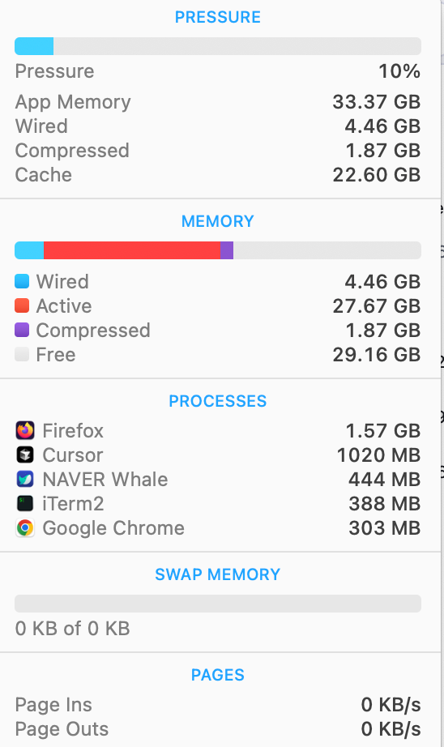

## 개요

새로운 Mac을 선택할 때 가장 중요한 결정 중 하나는 메모리(RAM) 용량을 어떻게 구성해야하는가에 대해 고민이 많습니다. 이 가이드는 필요한 RAM 용량을 결정하는 데 도움을 줍니다.

2020년 M1 칩의 등장과 함께 RAM에 대한 기존의 개념이 변화하였으며, 이에 따라 사용자들이 메모리 옵션을 선택할 때 새로운 고려 사항이 생겼습니다. 기존 PC에서는 CPU와 GPU가 각각 전용 메모리 풀을 사용했지만, 애플의 통합 메모리 아키텍처는 모든 프로세싱 유닛이 하나의 고대역폭, 저지연 메모리를 공유하도록 설계되었습니다.

## 옵션들

여러분의 작업 방식과 예산에 맞는 최적의 선택을 할 수 있도록, 현재 Mac 라인업에서 제공하는 각 메모리 옵션별 특징과 어떤 사용자에게 적합한지 정리해 보았습니다.

#### 16GB – 일반 사용자, 학생, 사무용 사용자

- ✅ 웹 브라우징, 동영상 스트리밍, 문서 작업, 멀티태스킹
- ✅ 이메일, 일정 관리, 기본적인 생산성 앱 사용

16GB RAM은 일반 사용자와 학생들에게 적합한 기본 구성입니다. macOS의 메모리 관리가 뛰어나므로 가벼운 멀티태스킹도 원활하게 수행할 수 있습니다.

#### 24GB – 가벼운 크리에이티브 작업 및 멀티태스킹 사용자

- ✅ 영상 편집(라이트한 작업), 그래픽 디자인, 게임, 프로그래밍
- ✅ 여러 개의 무거운 앱을 동시에 실행하는 경우

16GB보다 조금 더 여유로운 환경이 필요한 사용자에게 적합합니다. 영상 편집, 코딩, 그래픽 디자인과 같은 작업을 하지만 전문적으로 하지 않는 경우 24GB가 적당한 선택이 될 수 있습니다.

#### 32GB / 36GB / 48GB – 전문 크리에이터 및 개발자

- ✅ 4K 영상 편집, 음악 제작(다수의 트랙 사용), 대규모 코딩 프로젝트
- ✅ Adobe Creative Cloud, Xcode, 가상 머신(VM) 실행

고사양 애플리케이션을 자주 사용하거나, 대형 프로젝트를 진행하는 경우라면 32GB 이상을 고려해야 합니다. 메모리 부족으로 인한 성능 저하를 줄이고, 원활한 작업 환경을 유지할 수 있습니다.

#### 64GB – 고해상도 미디어 작업 및 하이엔드 유저

- ✅ 3D 모델링, 8K 영상 편집, 복잡한 시뮬레이션, 데이터 분석
- ✅ 다중 가상 머신(VM) 실행, 고사양 소프트웨어 개발 환경 운영

64GB는 영상, 3D 디자인, 데이터 분석 등의 작업을 하는 크리에이티브 전문가들에게 적합합니다. 높은 사양이 요구되는 소프트웨어를 동시에 실행해도 원활한 성능을 보장합니다.

#### 96GB – 대용량 데이터 및 고급 크리에이티브 작업

- ✅ 고해상도 영상 편집(다중 8K 스트림), 정밀한 3D 렌더링
- ✅ 대규모 데이터셋 처리, 머신러닝 및 AI 모델 학습

## 💡 저의 선택은

백엔드 개발자로서, 회사에서 제공하는 개발용 컴퓨터를 기준으로 모니터링해보면 보통 40GB 이하의 메모리를 사용합니다. 개발 환경은 IDE(Goland), 여러 개의 텍스트 에디터(Cursor, VS Code), 회사 보안 프로그램, Notion, 브라우저(30~40개 탭), Docker 등을 포함합니다.

현재 M1 Max 64GB 모델을 사용 중이며, 당시에는 로컬에서 쿠버네티스와 여러 개의 컨테이너를 띄우며 테스트할 필요가 있어 고사양 장비가 필수적이었습니다. 다음 맥을 구매할 때 어떤 스펙을 선택할지 고민하는 분들을 위해 제 추천을 공유합니다.

• **학생**: 16GB MacBook Air 또는 Pro
• **일반 개발자**: 24~48GB MacBook Pro (예산이 충분하다면 48GB가 좋지만 필수는 아님)
• **AI 모델을 맥에서 실행하고 싶다면**: 추천하지 않으며, NVIDIA GPU가 있는 컴퓨터를 권장

애플이 메모리 압축을 잘 활용하기 때문에 메모리보다는 Max 계열 CPU의 높은 메모리 대역폭이 체감 속도를 개선하는 데 더 큰 영향을 미칩니다. 다만, Max 계열 CPU는 가격이 다소 부담스러운 것이 단점이네요. 😅

현시점에서 구매한다면 **M4 Pro - 48GB** 모델을 약 400만 원 내외로 구매할 예정입니다!
